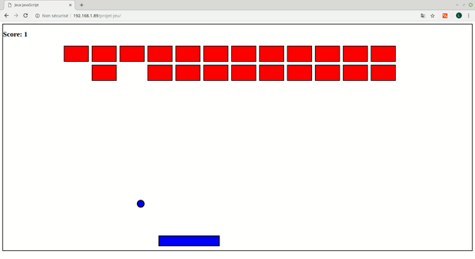
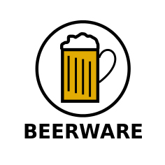

# Présentation du projet jeu 2.0.0

*ce projet a pour but d'approfondir nos connaissances en javascript dans un contexte inhabituel, mais de pouvoir les réutiliser plus tard dans  des projets plus concrets.*


---

## Technologies utilisées 


* HTML
* CSS
* JavaScript (Variables, Fonctions, Conditions, Evenements, Boucles)

---


## Intérêt 


* mise en pratique des connaissances
* utiliser le JavaScript dans un autre contexte
* pour le portfolio

---

## Démo du jeu 

**Voilà l'interface du jeu:**



---

## Versions à venir

Comme vous pouvez le constater sur la démo en gif du jeu. La trajectoire de la balle est **aléatoire.**
En fin de partie ça peut vite devenir agaçant. Dans les prochaines mises à jour je tenterais **d'améliorer** la trajectoire. 

---

## Modifications de la 2.0.0

cette mise à jour majeure a ajouté la fonctionnalité de bouger le pad grâce à la souris et régler les problèmes 
de balle qui sort du cadre de jeu.


---

## Exemple de code utilisé pour faire rebondir la balle

```
let vLeft = 0;
let vTop = -10;
setInterval(function () {
    maBalle.style.left = maBalle.offsetLeft + vLeft + 'px';
    maBalle.style.top = maBalle.offsetTop + vTop + 'px';

    maCollision();
    collisionPad();
    collisionWall();
}, 50);

function maCollision() {
    for (let item of newCarrer) {

        if (!item.classList.contains('destroyed')) {


            if (maBalle.offsetLeft < item.offsetLeft + item.offsetWidth &&
                maBalle.offsetLeft + maBalle.offsetWidth > item.offsetLeft &&
                maBalle.offsetTop < item.offsetTop + item.offsetHeight &&
                maBalle.offsetHeight + maBalle.offsetTop > item.offsetTop) {
                console.log('bloup');
                item.classList.add("destroyed")
                vLeft = randomIntFromInterval(-15, 15)
                vTop = -vTop
            }
        }
    }
}

```

---

## Version test

Le jeu est dans sa version 2 donc des améliorations sont à venir.

---

## Licence  

Mon projet utilise la licence Beerware, pour plus d'**INFORMATION :**  [Wikipedia](https://fr.wikipedia.org/wiki/Beerware)


  
  **"LA LICENCE BEER-WARE"**

  
 
 *Du moment que vous utilisez mon code avec cette licence, vous pouvez en faire ce que vous voulez.*
 
 **Néanmoins si mon projet vous plait, et qu'on se rencontre en personne vous pouvez m'offrir une bière.** 
 
 (apparement ça marche comme ça)
  
 


